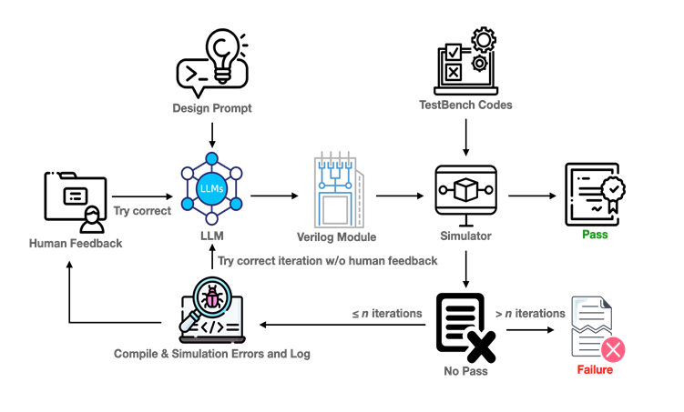

# AutoGenRTL — 自然語言轉 RTL 自動生成工具

## 📌 專案簡介

AutoGenRTL 是一套自動將自然語言描述轉換為 Verilog RTL 模組的架構。該系統結合了大型語言模型（LLM），模仿工程師在編寫代碼時的修正流程，根據每次的錯誤訊息或與預期不同的行為進行跌代修正，並透過 Testbench 驗證生成結果的正確性。

---

## 🏆 獲獎紀錄

| 比賽名稱 | 舉辦單位 | 年份 | 獎項 | 展示 |
|----------|-----------|------|------|--------|
| Let's Chat AI 創意應用競賽 | 長庚大學 | 2024 | 第三名 ( 30 組參賽、10 組晉級決賽) | [查看](awards/lets-chat-ai.md) |
| 全國大專院校產學創新實作競賽人工智慧應用組 | 國立彰化師範大學工學院 | 2024 | 第二名 ( 54 組晉級決賽) | [查看](awards/nicai.md) |
| 數位雙生學生作品競賽 | 社團法人台灣數位雙生學會 | 2024 | ( 11 組晉級決賽、4 組佳作) | [查看](awards/dtsc.md) |

## 系統架構圖

---

## 💡 技術亮點

- 使用 OpenAI API 建構語意理解與程式生成流程
- 自訂 Prompt 模板模仿 RTL 工程師的修正邏輯
- 根據錯誤訊息以及非預期行為對 Prompt 進行優化
- 透過生成時序圖增加 Prompt 輸入，提高 sequential 電路的成功率
- Python 串接自動測試系統驗證 Verilog 模組
- 將語言模型應用於硬體開發(HDL)輔助的創新實驗

---

