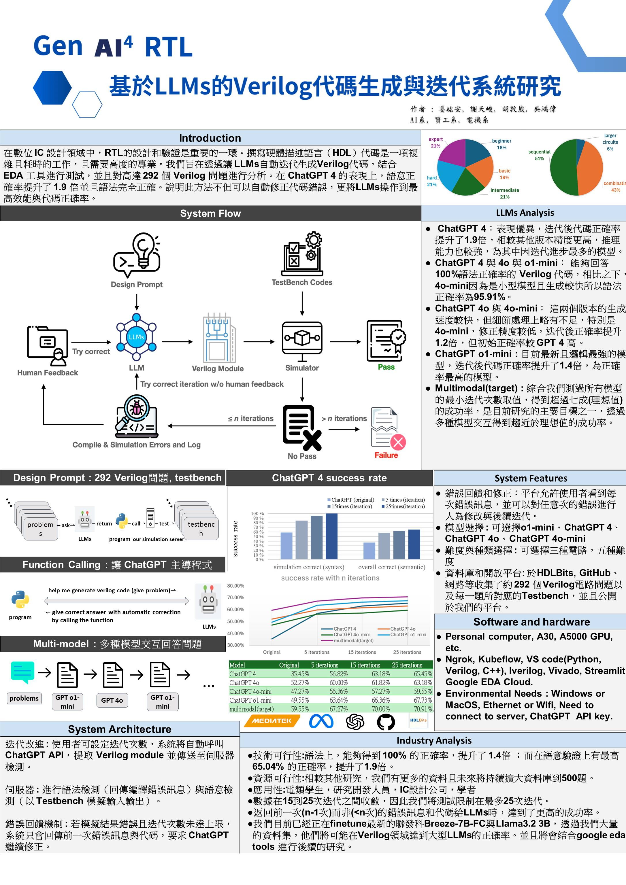

# 數位雙生學生作品競賽 2024 — 佳作

## 🏁 比賽資訊
- 主辦單位：台灣數位雙生學會
- 時間：2024 年 7 月
- 組別：學生創新專題組
- 參賽組數：11 組進入決賽，其中 4 組獲得佳作
- 得獎名次：**佳作**

## 🖼️ 海報展示

[📄 點我下載 PDF 海報](../poster/dtsc-poster.pdf)

## 💬 心得反思

這場比賽著重於數位雙生（Digital Twin）概念的應用，我們在投稿時重新包裝 AutoGenRTL 的核心價值，強調與數位雙生的連結，並成功入選正賽。

然而，由於賽程安排，我們在正賽中獲得的講解時間有限，未能完整呈現整個系統的設計與優勢，最終未能晉級前三名。這對我們團隊而言是一大挫折，特別是在本次我們對獲獎抱持極高期待。

儘管如此，這次經驗也啟發我們學會調整簡報策略：面對不同的時間限制，應優先傳達最關鍵的價值與亮點，而非拘泥於鉅細靡遺地說明系統全貌。要如何將研究成果在短時間內包裝好呈現給評審看對我來說是一大挑戰。
