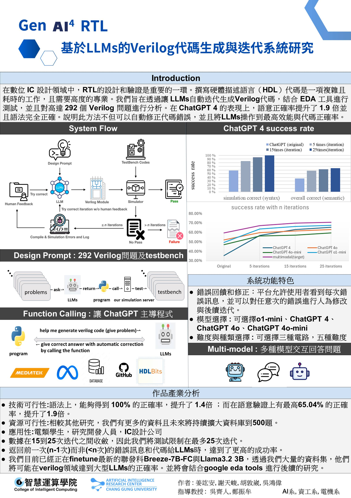

# 全國大專院校產學創新實作競賽 2024 — 第二名

## 🏁 比賽資訊
- 主辦單位：國立彰化師範大學工學院
- 時間：2024 年 6 月
- 組別：人工智慧應用組
- 參賽組數：54 組晉級決賽
- 得獎名次：**第二名**

## 🖼️ 海報展示

[📄 點我下載 PDF 海報](../poster/nicai-poster.pdf)

## 💬 心得反思

這場比賽是相當大型的比賽，光是進到決賽的隊伍就超過了 50 隊，相對第一次比賽，我們新增了在跌代過成功可進行人為修正的功能，並特別強調了 AutoGenRTL 在硬體開發流程中可作為設計輔助的角色，例如初步原型設計、自動產生範例模組等。

我們也準備了一段 demo 展示系統將自然語言轉為 RTL 的過程，讓評審能清楚了解整個系統運作。過程中我們與業界評審討論未來商品化可行性，這對我們的專案規劃產生重大啟發。

能從全國 54 組中脫穎而出拿下第二名，是對我們技術實現與創新性的極大肯定。
